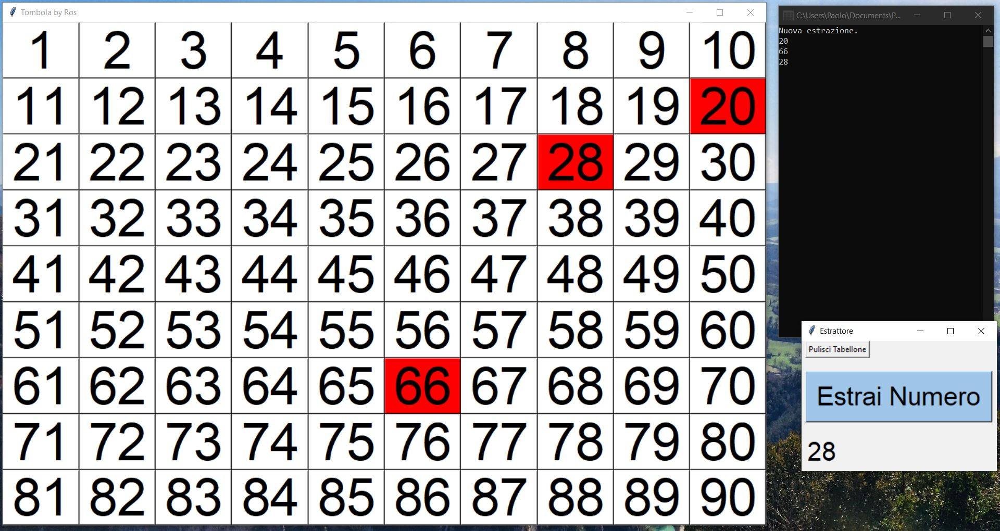

# Tombola per proiettore

The .exe is in the folder: Tombola_windows > dist > Tombola.exe

It's better to use a projector with extended mode: one with the "tabellone" in full screen and the other with the extractor.

