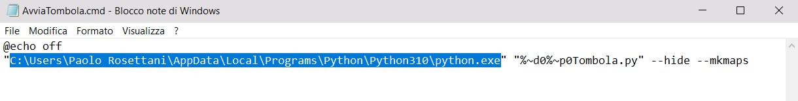
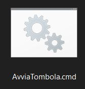
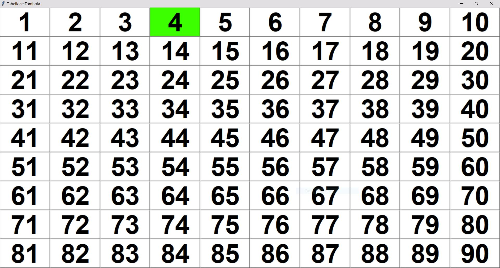
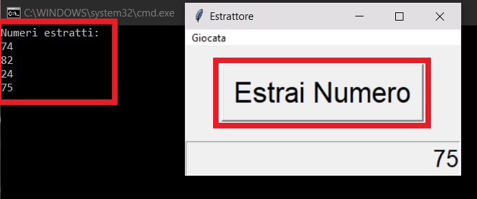
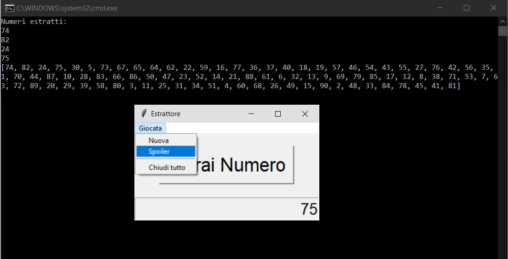
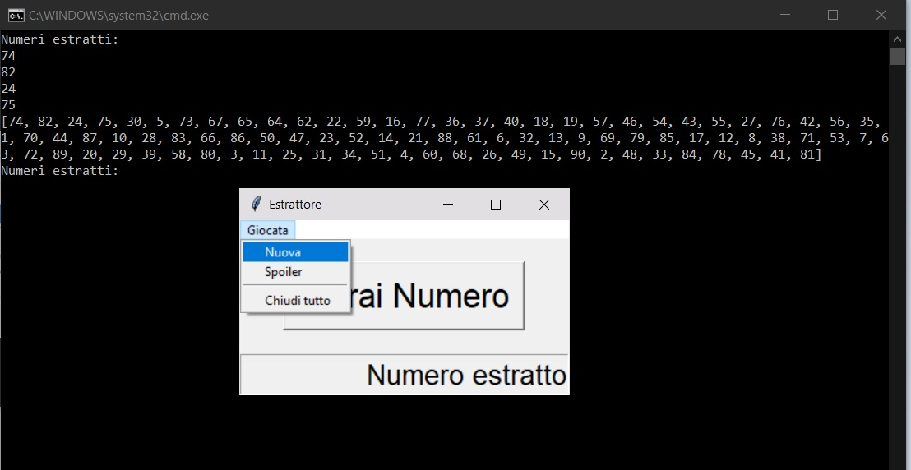

# Tombola per proiettore


<!-- GETTING STARTED -->
## Installazione

### Installare Python

* <a href="https://www.python.org/downloads/">Scaricare</a> ed installare Python.


### Installare librerie

Copiare e lanciare i seguenti comandi nel terminale:

```
pip install random
```
```
pip install tk
```

### Modifica del Batch di avvio
Tasto destro > Modifica sul file "AvviaTombola.cmd".
  <p align="center"></p>
Nella parte evidenziata in blu inserire la directory di "python.exe".
Per trovare la directory di Python lanciare il seguente comando nel terminale: (<a href="https://stackoverflow.com/questions/647515/how-can-i-find-where-python-is-installed-on-windows">Source</a>)

```
where python
```


### Avvio applicazione
Doppio click sul seguente file (Windows only):
  <p align="center"></p>

Si apriranno 3 finestre:
1. Terminale: su cui verranno stampati i numeri estratti
2. Estrattore: con il pulsante per estrarre un nuovo numero
3. Tabellone: da mostrare sullo schermo da proiettare

## Funzioni
### Inserimento Manuale
Premere il numero estratto manualmente direttamente sul tabellone ingorando completamente l'estrattore automatico.
 <p align="center"></p>

#### Nota
Per mostrare il tabellone a schermo intero preme il pulsante "F11" dalla tastiera (verificare che la finestra del tabellone sia quella attiva durante la pressione del pulsante "F11"). Se si proietta in modalità Desktop "Esteso", il tabellone a schermo intero verrà mostrato sul desktop principale e non su quello secondario/esteso. 

### Estrazione automatica
Premere il pulsante "Estrai Numero" per estrarre automaticamente i numeri. Il corrispettivo numero verrà evidenziato automaticamente sul tabellone.

 <p align="center"></p>

#### Nota
Non usare le due modalità di estrazione (manuale ed automatica) in maniera promiscua. Scegliere una sola modalità fin dall'inizio.

### Spoiler
La successione di tutti i numeri è definita a priori. È possibile visualizzarla per intero prima o durante la giocata.

 <p align="center"></p>

### Reset (Nuova giocata)
Per iniziare una nuova giocata premere il pulsante "Giocata > Nuova". Il tabellone verà pulito in automatico.
 <p align="center"></p>

### Features
È possibile modificare: il font dei numeri, la loro dimensione, il colore di evidenziazione dei numeri.
Il programma è predisposto per la pronuncia dei numeri in automatico. Mancano le tracce audio di alcuni numeri.
È compatibile con Ubuntu.
È compatibile con Mac OS, ma con le dovute (piccole) modifiche.


## Notes
I'm not proud of this coding style. It has been made in few hours.
